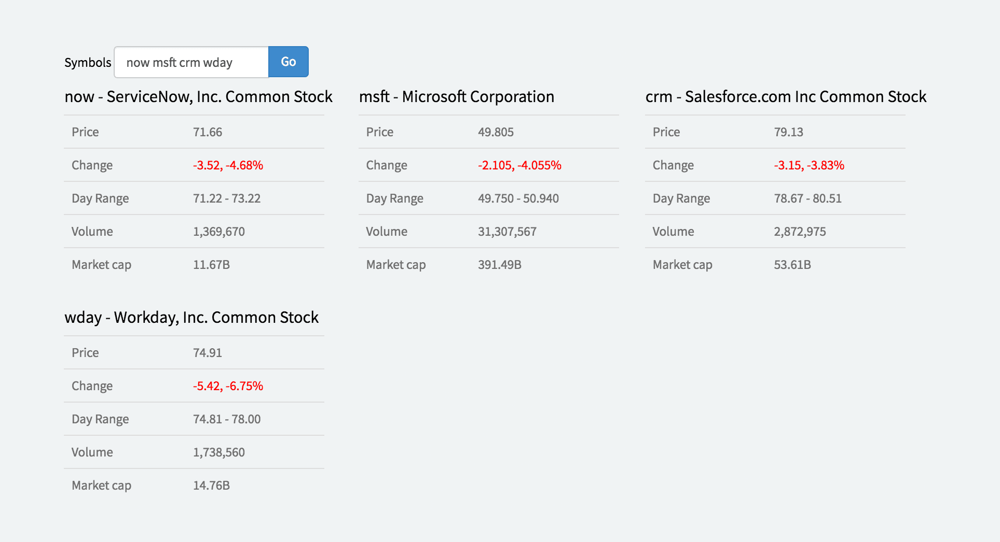

# Stock Price Widget
A sample widget that demonstrates following:

- Bootstrap inline form
- Flexbox wrapping
- Scoped SCSS
- Client / Server interaction
- GlideHTTP to an external service
- ECMA5 JSON.parse(), encoding URL

##Preview

## Installation

1. Go to [`x-stock.xml`](src/x-stock.xml?raw=true) and right click, Save As...
2. Go to your instance and import the downloaded xml file using [`x-loader`](https://github.com/service-portal/x-loader)
3. That's all! View the widget by navigating to yourinstance/$sp.do?id=x-stock
